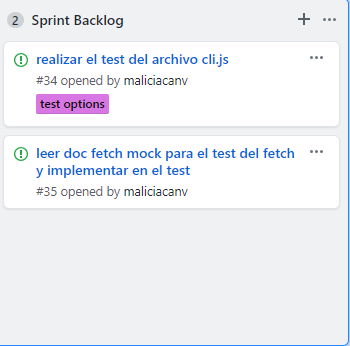
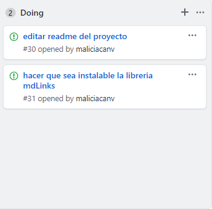
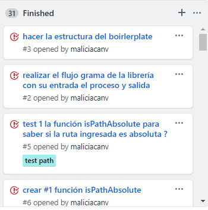

# Markdown Links

## Preámbulo

[Markdown](https://es.wikipedia.org/wiki/Markdown) es un lenguaje de marcado
ligero muy popular entre developers. Es usado en muchísimas plataformas que
manejan texto plano (GitHub, foros, blogs, ...), y es muy común
encontrar varios archivos en ese formato en cualquier tipo de repositorio
(empezando por el tradicional `README.md`).

Estos archivos `Markdown` normalmente contienen _links_ (vínculos/ligas) que
muchas veces están rotos o ya no son válidos y eso perjudica mucho el valor de
la información que se quiere compartir.

### Flujograma de la librería


#### Un board con el backlog para la implementación de la librería.

Para implementar la librería markdown, cree un proyect en git hub es como un tablero, donde tiene 4 partes: backlog, doing, bloqued, finished.
También cree issus con las tareas que asigne que debían incluir para realizar la libreria, asimismo se creo mailestone por sprint que correspondía a cada issus y también los labels que identificadaba a cada issus en que archivo se tenia que implementar.







##### Documentación técnica de la librería.

La librería md-links cumple la función de analizar la ruta que ingresas y va a identificar solo los archivos Markdown y buscar si tiene links.
En caso lo tuviera te mostrara los links encontrados.

El Markdown tambien tiene opciones:
Validar los links encontrados, es decir mostrar en que estado se encuentra cada link.
Obtener estadisticas de los links encontrados, como el total y unicos de links.
Obtener la estadisticas de los links encontrados con el total, unicos y rotos.

Por ejemplo:

Si ingresas md-links <ruta> 
solo te mostrara los links, el nombre del link y a la ruta que pertenece.

$ md-links ./some/example.md
./some/example.md http://algo.com/2/3/ Link a algo
./some/example.md https://otra-cosa.net/algun-doc.html algún doc
./some/example.md http://google.com/ Google

Si ingresas md-links <ruta> 1opcion

```sh
$ md-links ./some/example.md --stats
Total:3
Unicos:3
```

Si ingresas md-links <ruta> 2opcion

```sh
$ md-links ./some/example.md --validate
./some/example.md http://algo.com/2/3/ 200 ok Link a algo
./some/example.md https://otra-cosa.net/algun-doc.html 404 Not Fail algún doc
./some/example.md http://google.com/ 200 ok Google
```

Si ingresas md-links <ruta> 2opcion

```sh
$ md-links ./some/example.md --validate --stats
Total:3
Unicos:3
Rotos:1
```

###### Guía de uso e instalación de la librería

Módulo instalable via `npm install <github-user>/md-links`. Este módulo debe
incluir tanto un ejecutable como una interfaz que podamos importar con `require`
para usarlo programáticamente.


